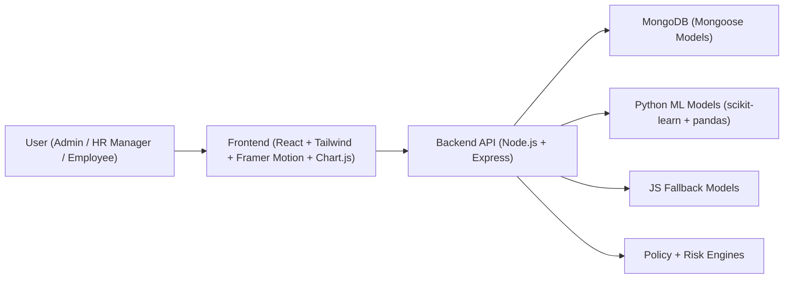
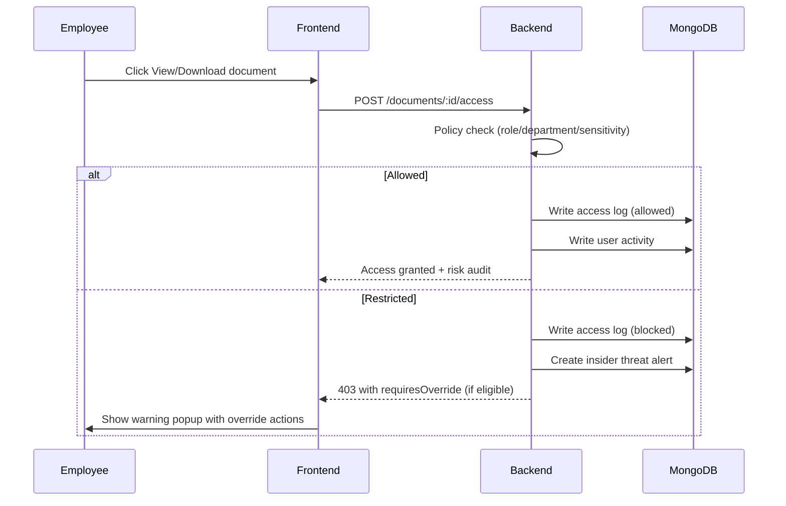
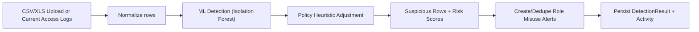
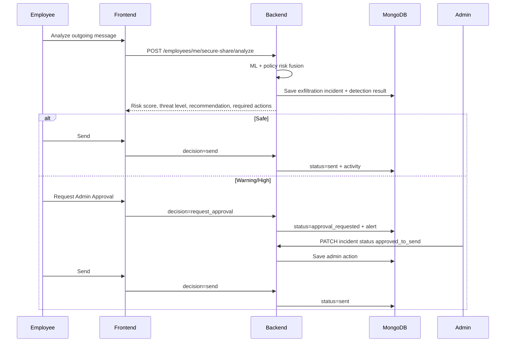

# Access Guard AI
## System Architecture and Technical Design

Version: 1.0  
Last Updated: 2026-03-29  
Scope: Current implemented codebase (frontend, backend, database, ML, security, deployment)

---

## 1. Platform Purpose

Access Guard AI is an enterprise cybersecurity monitoring platform prototype designed to detect and respond to:
- Insider threats
- Unauthorized document access
- Role misuse anomalies
- Malicious document content
- Spam/phishing emails
- Outbound data exfiltration risk
- Abnormal employee behavior

The system supports real user accounts, role-based authorization, persisted security telemetry, risk scoring, and admin response actions.

---

## 2. Architecture Overview

### Core design principles
- Single API backend for all business logic and security checks
- MongoDB as source of truth for users, logs, alerts, and incident state
- Hybrid ML execution:
  - Python models when available (local/dev)
  - JavaScript fallback models for reliability (especially serverless)
- Role-isolated admin and employee experiences with route guards
- Security actions are auditable and persisted

---

## 3. Technology Stack

## 3.1 Frontend
- React 18
- React Router v6
- Tailwind CSS
- Framer Motion
- Chart.js + react-chartjs-2
- Axios
- Vite
- vite-plugin-pwa

## 3.2 Backend
- Node.js
- Express.js
- Mongoose
- JWT (`jsonwebtoken`)
- bcrypt (`bcryptjs`)
- multer (file upload)
- pdf-parse (PDF extraction)
- mammoth (DOCX extraction)
- xlsx (CSV/Excel parsing)

## 3.3 ML
- Python
- scikit-learn
- pandas
- numpy

## 3.4 Database
- MongoDB

## 3.5 Deployment target
- Vercel frontend (static SPA)
- Vercel backend (serverless function handler)
- MongoDB Atlas (production)

---

## 4. Frontend Architecture

## 4.1 App routing and role guards

Public routes:
- `/` - Landing page
- `/login` - Auth page

Admin routes:
- `/admin/overview`
- `/admin/monitoring`
- `/admin/analytics`
- `/admin/detections`
- `/admin/role-misuse`
- `/admin/employees`

Employee/HR routes:
- `/employee/profile`
- `/employee/documents`
- `/employee/secure-share`
- `/employee/activity`
- `/employee/notifications`

Route protection behavior:
- If unauthenticated, redirect to `/login`
- If role is unauthorized for a route group, redirect to role default workspace
- Admin and employee have separate layouts and sidebars

## 4.2 Global layout pattern

Structure:
- Sidebar
- Top navbar
- Main content area

Shared UX behaviors:
- Responsive mobile drawer menus
- Notification bell with portal-based dropdown
- Animated section transitions
- Polling for new security events and notifications

## 4.3 Frontend service layer

`dashboardService.js` centralizes API integration for:
- Overview and analytics data
- Alerts and risk table
- Role misuse scans
- Document access and scan actions
- Employee management actions
- Secure Share Guard analyze/decision flows
- Detection history and exfil incident queue

## 4.4 Admin modules (implemented)

### Dashboard Overview
- KPI cards:
  - Total employees
  - Active alerts
  - Suspicious employees
  - Malicious documents
  - Documents scanned
  - Spam emails detected
  - Emails scanned
  - Data exfil attempts
  - System overall risk score
  - System threat level
- Highest risk employees panel
- Live security feed panel
- Recent alerts table

### Threat Monitoring
- Insider threat and risk table with actions:
  - Send alert
  - Block/unblock account
- Data exfiltration incident queue with actions:
  - Alert
  - Block/unblock account
  - Approve send
  - Investigate
  - Resolve
- Active alert queue and blocked-user alert queue separated
- Bulk resolve capabilities by scope

### Threat Analytics
- Multi-view chart tabs:
  - Threat Ops model
  - Behavior Risk model
  - Email Intelligence model
  - LeakGuard model
- Includes line, bar, doughnut, radar charts
- Interactive drill-down: clicking chart elements loads filtered alert table

### AI Detection Modules
- Document scanning (PDF/DOCX/TXT)
- Email scanning (Safe/Spam/Phishing)
- Scan animation while processing
- Recent activity tab:
  - Document scan history
  - Email scan history
  - Total scan counters

### Role Misuse Model page
- CSV/XLS/XLSX upload scanning
- "Use Current App Data" scanning (from live access logs)
- Suspicious highlight rows
- Ranked risk output
- Expected CSV format hints

### Employee Management
- Create employees
- Employee directory with filters
- Permanent deletion with confirmation + PIN
- Delete action removes employee and linked security records

## 4.5 Employee modules (implemented)

### Security Center/Profile
- Personal risk score and threat level
- Security score meter
- Blocked attempts and sensitive access counts
- Last login and secure-share risk stats
- Recommendations and recent docs
- Recent notifications

### Document Portal
- Document list with policy-aware tags
- Search/filter by sensitivity
- View/download actions
- Restriction handling:
  - Shows warning popup
  - Allows "Open Anyway" / "Download Anyway" for override-eligible docs
  - Logs and alerts generated on unauthorized attempts/overrides

### Secure Share Guard
- Analyze outgoing email for leakage risk
- Optional document context selection
- Shows detailed score breakdown and recommendation
- Decision model:
  - Safe path: Send or Cancel
  - Warning/High path: Request Admin Approval or Cancel
  - After admin approval: Send is enabled
- Includes incident history and counters (total, approved, sent, blocked)

### Activity and Notifications
- Personal activity history
- Security notification stream
- Account status badge (Active/Blocked)

## 4.6 UI and theming
- Light cyber-professional theme
- Custom typography and gradients
- Glass panels and animated accents
- Severity color language:
  - Safe: green
  - Warning: amber
  - Threat: red

## 4.7 PWA implementation
- `vite-plugin-pwa` enabled
- Generated manifest and service worker
- Auto-update SW registration
- Runtime API cache strategy:
  - NetworkFirst for `/api/*`
  - Timeout and expiry controls

---

## 5. Backend Architecture

## 5.1 Runtime entrypoints
- `app.js`:
  - Express app setup
  - CORS, JSON limits, logger, route mounts, error middleware
- `server.js`:
  - Loads env
  - Connects MongoDB
  - Starts local server
- `api/index.js`:
  - Vercel serverless entry
  - Connects MongoDB then delegates request to Express app

## 5.2 Middleware
- `authenticate`:
  - Validates JWT
  - Loads user
  - Blocks access when `accountStatus = Blocked`
- `authorizeRoles(...roles)`:
  - Enforces role authorization
- `asyncHandler`:
  - Standard async error wrapper

## 5.3 Backend domains

### Authentication domain
- Login
- Bootstrap admin (first-run only when no users)
- Current user profile endpoint

### Employee governance domain
- Create/list employees
- Block/unblock account
- Send manual alerts
- Delete employee with PIN confirmation
- My notifications and my security summary
- Secure Share endpoints for employee self-service

### Document security domain
- List documents with policy decoration
- Document access action (view/download) with enforcement
- Document upload scanning for malicious signals
- Scan history

### Threat intelligence domain
- Overview KPIs
- Analytics and timelines
- Live feed
- Alerts list/search/update
- Bulk alert resolution
- Risk table
- Detection history
- Email scanner
- Role misuse scanner (upload and current-data mode)
- Admin exfiltration incident queue

### Activity domain
- Employee activity timeline
- Admin access logs view

---

## 6. Data Model and Persistence

## 6.1 Collections

### `users`
- `employeeID` (unique, indexed)
- `name`
- `email` (unique)
- `password` (bcrypt hash)
- `role` (`Admin` | `HR Manager` | `Employee`)
- `department`
- `accountStatus` (`Active` | `Blocked`)
- `blockedReason`
- `blockedAt`
- `blockedBy`
- `createdAt` (timestamp)

Behavior:
- Auto-generates `employeeID` in `EMP###` format (unless explicit ID provided)
- Password auto-hashed on save

### `documents`
- `documentID` (unique, indexed)
- `name`
- `department`
- `sensitivityLevel` (`Public` | `Internal` | `Confidential` | `Top Secret`)
- `content`
- `tags`
- timestamps

Behavior:
- Auto-generates `documentID` in `DOC###`

### `accesslogs`
- `employeeID`
- `role`
- `documentName`
- `action` (`view` | `download`)
- `status` (`allowed` | `blocked` | `override`)
- `timestamp`
- `metadata`

### `useractivities`
- `employeeID`
- `loginTime`
- `documentAccessed`
- `actionType` (login/view/download/upload/email_scan/secure_share_* etc.)
- `timestamp`
- `department`
- `sensitivityLevel`
- `metadata`

### `alerts`
- `type` (`Insider Threat`, `Role Misuse`, `Malicious Document`, `Phishing Email`, `Behavior Anomaly`, `Data Exfiltration`)
- `severity` (`low` | `warning` | `high`)
- `message`
- `employeeID`
- `riskScore` (0-1)
- `status` (`open` | `investigating` | `closed`)
- `metadata`
- timestamps

### `detectionresults`
- `type` (`Document` | `Email` | `Role Misuse` | `Behavior` | `Data Exfiltration`)
- `sourceName`
- `prediction`
- `riskScore`
- `details` (model output payload)
- `createdBy`
- timestamps

### `exfiltrationincidents`
- Employee context, recipient context, document context
- `riskScore`, `threatLevel`
- `requiresOverride`, `hardBlocked`
- `status` lifecycle:
  - `analyzed`
  - `blocked_pending_override`
  - `approval_requested`
  - `approved_to_send`
  - `sent`
  - `sent_override`
  - `cancelled`
  - `investigating`
  - `resolved`
  - `blocked_by_policy`
- `scores` breakdown
- `evidence`
- `adminAction`
- timestamps

### `counters`
- `_id` sequence key (`employeeID`, `documentID`)
- `seq`

## 6.2 Seed and maintenance scripts
- `seed.js`: seeds demo users/docs/events
- `resetUsers.js`: resets users to fixed small baseline set
- `cleanupOrphanSecurityData.js`: removes security records for deleted users

---

## 7. Security Architecture

## 7.1 Authentication and session security
- JWT token issued at login
- Token includes user ID, employeeID, role, department, accountStatus
- Token required on protected APIs
- Blocked users denied in middleware even with valid token

## 7.2 Authorization model
- Admin-only:
  - Threat and analytics APIs
  - Incident queue control
  - Employee block/unblock/delete
- Admin + HR Manager:
  - Employee create/list
- Employee + HR Manager:
  - Employee workspace routes

## 7.3 Document access control
- Admin has full access
- HR manager has scoped policy access
- Employee policy checks:
  - Always allowed on public
  - Allowed on department-matched docs
  - Top Secret blocked for non-admin
- Violations create logs and alerts

## 7.4 Account block and risk-separation behavior
- Blocking/unblocking does not artificially increase personal/system risk through admin-control noise
- Admin control signals are filtered out of risk math
- Blocked users are separated from active dashboard counts
- Blocked-user alerts are shown in separate queue

## 7.5 Data deletion controls
- Admin can permanently delete non-admin users
- Requires:
  - Confirmation flag
  - PIN (`EMPLOYEE_DELETE_PIN`, default `12345678`)
- Deletes user and associated logs/alerts/activities/incidents/detections

## 7.6 Network and API controls
- CORS origin allowlist from env (`FRONTEND_URL`)
- Upload size limits:
  - Document scan: 8MB
  - Role misuse upload: 10MB

---

## 8. ML System Design

## 8.1 Execution strategy

`mlService.js` chooses model runtime:
- Python path:
  - Enabled by `USE_PYTHON_MODELS=true`
  - Runs scripts from `ml_models/*.py` with temp JSON payload
- JS fallback:
  - Enabled by `ALLOW_JS_ML_FALLBACK=true`
  - Used when Python disabled or execution fails

This allows consistent behavior in local and serverless environments.

## 8.2 Model catalog

### 1) Malicious document detector
- File: `document_detector.py`
- Algorithm: TF-IDF + Logistic Regression
- Inputs: document text
- Outputs:
  - `risk_level`
  - `risk_score`
  - `suspicious_keywords`
  - `suspicious_sentences`

### 2) Spam/phishing email detector
- File: `spam_email_detector.py`
- Algorithm: TF-IDF + Multinomial Naive Bayes
- Inputs: email content
- Outputs:
  - `prediction` (`Safe`/`Spam`/`Phishing`)
  - `confidence`
  - `suspicious_keywords`

### 3) Role misuse detector
- File: `role_misuse_detector.py`
- Algorithm: Isolation Forest + policy rule fusion
- Inputs: tabular rows (`EmployeeID`, `Role`, `AccessedResource`, `Timestamp`)
- Outputs:
  - per-row `Risk Score`
  - `Status` (`Suspicious`/`Normal`)

### 4) Data exfiltration detector
- File: `data_exfiltration_detector.py`
- Algorithm: TF-IDF similarity + Logistic classifier + keyword matching
- Inputs:
  - document text
  - outgoing email text
  - subject
- Outputs:
  - `similarity_score`
  - `content_risk_score`
  - `risk_level`
  - `suspicious_keywords`
  - `matched_sentences`

---

## 9. Risk Scoring and Threat Logic

## 9.1 Threat label mapping
- `Safe` for score < 0.4
- `Warning` for score >= 0.4 and < 0.7
- `High` for score >= 0.7

## 9.2 Behavior risk score (employee)

Risk combines weighted behavioral and alert signals:
- blocked ratio
- override ratio
- download ratio
- off-hours login ratio
- sensitive action ratio
- high-severity alert ratio
- average alert risk
- data exfil alert ratio

Special behavior:
- If no active alerts remain, score is clamped below warning threshold to prevent stale warning badges after resolution.

## 9.3 Insider threat document risk
- Uses sensitivity baseline from permission service
- Unauthorized actions increase risk and trigger insider-threat alerts
- Override flow on non-top-secret restricted docs triggers elevated monitoring

## 9.4 Data exfiltration risk formula (secure share)

Backend fuses:
- similarity signal
- sensitivity signal
- recipient externality signal
- access chain signal
- policy mismatch signal
- keyword signal

Additional boosts:
- External + Top Secret document
- Recent prior high-risk incidents

Result drives:
- `threatLevel`
- `requiresOverride`
- `hardBlocked`
- recommendation text

## 9.5 System risk score
- Derived from active employees only
- Blocked users excluded from overall risk aggregation
- Dashboard still shows blocked-user queue separately

---

## 10. API Surface

## 10.1 Auth
- `POST /api/auth/bootstrap-admin`
- `POST /api/auth/login`
- `GET /api/auth/me`

## 10.2 Employees
- `GET /api/employees` (Admin, HR)
- `POST /api/employees` (Admin, HR)
- `GET /api/employees/permissions` (Admin, HR)
- `POST /api/employees/:employeeID/send-alert` (Admin)
- `POST /api/employees/:employeeID/block` (Admin)
- `POST /api/employees/:employeeID/unblock` (Admin)
- `DELETE /api/employees/:employeeID` (Admin)
- `GET /api/employees/me/notifications` (Authenticated)
- `GET /api/employees/me/security-summary` (Authenticated)
- `GET /api/employees/me/secure-share/incidents` (Authenticated)
- `POST /api/employees/me/secure-share/analyze` (Authenticated)
- `POST /api/employees/me/secure-share/:incidentId/decision` (Authenticated)

## 10.3 Documents
- `GET /api/documents` (Authenticated)
- `POST /api/documents/:documentId/access` (Authenticated)
- `POST /api/documents/scan` (Admin)
- `GET /api/documents/scan-history` (Admin)

## 10.4 Threat intelligence
- `GET /api/threats/overview` (Admin)
- `GET /api/threats/analytics` (Admin)
- `GET /api/threats/timeline-analytics` (Admin)
- `GET /api/threats/live-feed` (Admin)
- `GET /api/threats/alerts` (Admin)
- `GET /api/threats/alerts-search` (Admin)
- `PATCH /api/threats/alerts/:id` (Admin)
- `POST /api/threats/alerts/resolve-all` (Admin)
- `GET /api/threats/risk-table` (Admin)
- `GET /api/threats/detection-history` (Admin)
- `POST /api/threats/email-scan` (Admin)
- `POST /api/threats/role-misuse` (Admin)
- `POST /api/threats/role-misuse/current-data` (Admin)
- `GET /api/threats/exfil-incidents` (Admin)
- `PATCH /api/threats/exfil-incidents/:id` (Admin)

## 10.5 Activity
- `GET /api/activity/me` (Authenticated)
- `GET /api/activity/logs` (Admin)

---

## 11. Key Workflow Sequences

## 11.1 Document access with override path

## 11.2 Role misuse pipeline

## 11.3 Secure Share Guard

---

## 12. Deployment and Environment

## 12.1 Local
- Backend runs on `http://localhost:5000`
- Frontend runs on `http://localhost:5173`
- Frontend dev proxy routes `/api` to backend

## 12.2 Vercel production topology
- Backend project root: `backend`
- Frontend project root: `frontend`

Backend serverless behavior:
- `backend/vercel.json` routes all requests to `api/index.js`
- Mongo connection caching avoids reconnect overhead

Frontend production behavior:
- SPA rewrite to `index.html`
- `VITE_API_BASE_URL` points to backend project domain

## 12.3 Environment variables

Backend:
- `MONGODB_URI`
- `JWT_SECRET`
- `JWT_EXPIRES_IN`
- `FRONTEND_URL`
- `PYTHON_PATH`
- `USE_PYTHON_MODELS`
- `ALLOW_JS_ML_FALLBACK`
- `COMPANY_EMAIL_DOMAIN`
- `EMPLOYEE_DELETE_PIN` (optional override)

Frontend:
- `VITE_API_BASE_URL`

---

## 13. Test Assets and Validation Data

Included under `test_samples`:
- Document scan test `.txt` files
- Email scan test `.txt` files
- Exfiltration content test files
- Role misuse CSV templates/datasets

Role misuse expected columns:
- `EmployeeID`
- `Role`
- `AccessedResource`
- `Timestamp`

Backend sample CSV:
- `backend/sample_role_misuse_logs.csv`

---

## 14. Current Strengths

- Full-stack integration with persisted security telemetry
- Practical admin response capabilities
- Role-based route and API protection
- Hybrid ML architecture suitable for local and serverless
- Risk and alert lifecycle implemented end-to-end
- PWA-enabled responsive frontend

---

## 15. Known Production Gaps and Recommended Next Steps

Security hardening:
- Add refresh token rotation and token revocation strategy
- Add request rate limiting and login attempt throttling
- Add stronger centralized input validation (schema-based)

Reliability:
- Add background job queue for heavy scans
- Add retry/dead-letter strategy for ML task failures
- Add WebSocket/SSE for real-time push instead of polling

Engineering quality:
- Add unit/integration/e2e automated test suites
- Add API contract tests
- Add CI pipeline with lint/test/security checks

Compliance and audit:
- Add immutable audit exports
- Add configurable retention policies
- Add security event webhook integrations

---

## 16. Conclusion

Access Guard AI currently implements a robust enterprise-style cybersecurity prototype with clear separation of concerns across UI, API, persistence, policy enforcement, ML detection, and incident response workflows. It is suitable for demonstration, MVP validation, and iterative hardening toward production maturity.

